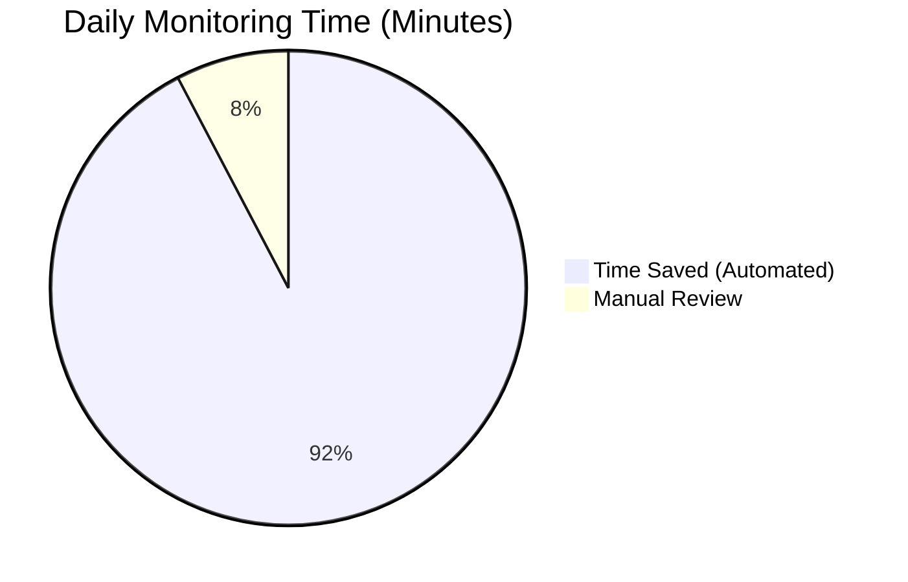
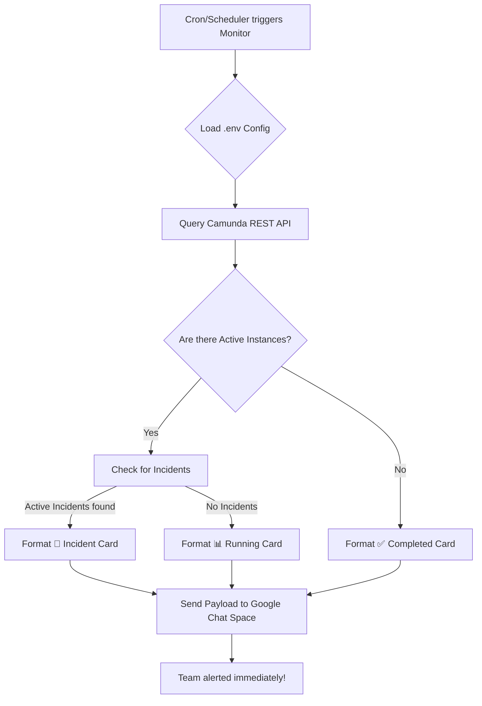

# ⚙️ Camunda Batch Monitor 📡

<div align="auto">
  
  
  
  
  <br/>
  
</div>

<br/>

A robust, lightweight Python application designed to automatically monitor Camunda 7 processes via its REST API. It proactively detects active instances and potential incidents, immediately dispatching rich, formatted status notifications directly to **Google Chat**. 

---

## 📈 The Impact: 1 Hour Saved Daily!

**Why does this exist?**
Before this automation, monitoring teams had to manually log into production servers, navigate through Camunda Cockpit, and continuously refresh to keep track of critical batch processes. 

✨ **Now, the Camunda Batch Monitor automation saves up to 1 entire hour daily for the monitoring team.** ✨ 

Instead of actively watching dashboards, the team receives real-time, actionable alerts straight in their communication channels. 



---

## ✨ Key Features

- 🎯 **Targeted Process Monitoring** — Select exactly what to monitor by defining `PROCESS_KEYS` in your `.env`.
- ⚡ **Direct REST API Integration** — Say goodbye to clunky browser automation. Queries Camunda 7 `/engine-rest/` endpoints directly for blazing-fast responses.
- 🚨 **Smart Incident Detection** — Automatically flags active incidents on running process instances and injects the details into your alerts.
- 💬 **Rich Google Chat Integration** — Dispatches beautifully formatted Card v2 messages to Google Chat via webhooks.
- 🔐 **Secure Configuration** — All sensitive credentials and URLs are safely managed via a `.env` file.
- 📊 **Variable Tracking** — Dynamically extracts critical process variables and pushes them to your notifications.
- 📝 **Automated Log Rotation** — Clean, daily-rotated telemetry out-of-the-box.

---

## 🏗️ Project Architecture

```plaintext
camunda-batch-monitor/
├── README.md
├── .gitignore
├── requirements.txt
├── config/
│   └── .env.example          # Config template (no secrets)
├── src/
│   └── camunda_monitor/
│       ├── __init__.py
│       ├── __main__.py        # CLI entry point
│       ├── config.py          # Config loader & validation
│       ├── api.py             # Camunda 7 REST API client
│       └── notifier.py        # Google Chat webhook sender
└── tests/
    └── __init__.py
```

---

## ⚙️ How It Works



1. **Initialize**: Loads configuration from your secure `.env` file.
2. **Scan**: Queries designated processes for active instances via the Camunda 7 REST API.
3. **Analyze**: Evaluates the health of active processes, explicitly checking for incidents or failures.
4. **Notify**: Dispatches a categorized Google Chat card:
   - 📊 **Running** — Process name, instance count, timestamp.
   - 🚨 **Incident** — Deep-dive error type and message details.
   - ✅ **Completed** — End-of-day summary confirming batch completion.
   - ❌ **Script Error** — Health check for the monitor itself.

---

## 🚀 Setup & Installation

### Prerequisites

- **Python 3.8+**
- Network access to your Camunda 7 engine (`/engine-rest/`)
- A Google Chat Space webhook URL

### Installation Steps

1. **Clone the repository**

2. **Install dependencies:**
   ```bash
   pip install -r requirements.txt
   ```
   > 💡 **Pro Tip**: `requirements.txt` uses minimum versions. For production stability, use `pip-compile` to freeze exact versions!

3. **Configure your environment:**
   Copy the example config and inject your magic:
   ```bash
   cp config/.env.example config/.env
   ```
   *Required Variables:*
   | Key | Description |
   |-----|-------------|
   | `CAMUNDA_URL` | Base URL of your Camunda instance (e.g. `https://host:8443/camunda`) |
   | `CAMUNDA_USERNAME` | REST API username |
   | `CAMUNDA_PASSWORD` | REST API password |
   | `GOOGLE_CHAT_WEBHOOK` | Google Chat Space webhook URL |
   | `PROCESS_KEYS` | Comma-separated list of process definition keys to monitor (e.g., `BatchProcess,LmdBatchProcess`) |
   | `TRACKED_VARIABLES` | Comma-separated list of process variables to include in notifications (e.g., `processKey,jobId`) |

---

## 💻 Usage

Run it manually or hook it up to a cron job:

```bash
# Using the default config path
python -m camunda_monitor

# Overriding with a custom config file
python -m camunda_monitor --config "/path/to/production.env"
```

---

## ⛷️ [Interactive Onboarding Guide](https://baibhavtripathi.github.io/Projects/camunda-batch-monitor/ONBOARDING.html)

Check out the onboarding page for a deep dive into advanced usage!

---

## 📜 License & Disclaimer

This project is licensed under the **MIT License** - see the [LICENSE](LICENSE) file for details.

### 📌 Open Source Attribution
Crafted with ❤️. If you use or modify this software, please give proper credit to **[@baibhavtripathi](https://github.com/baibhavtripathi)**. 

### ⚠️ Liability Waiver
**THE SOFTWARE IS PROVIDED "AS IS", WITHOUT WARRANTY OF ANY KIND.** 
By using this software, you acknowledge that the authors or copyright holders shall **not be liable** for any claims, damages (including direct, indirect, incidental, or consequential damages), or other liabilities arising from your use, deployment, or modification of this software. You are solely responsible for compliance with any organizational security policies when integrating with Camunda 7 REST APIs or Google Chat Webhooks.
